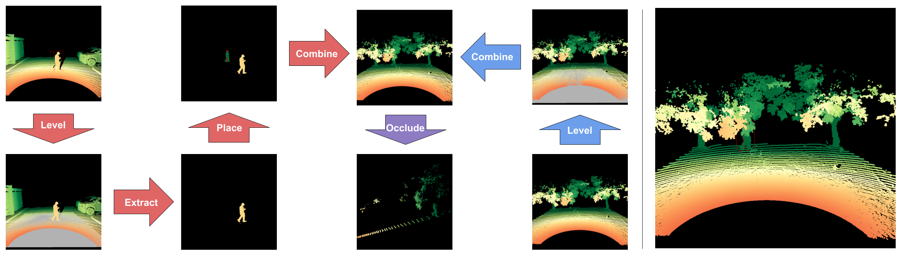

# Paved2Paradise

https://github.com/airalcorn2/paved2paradise/assets/1927770/75e6e064-0f9d-4fd5-8fb3-8542720ce4da

A PointPillars model trained *exclusively* on synthetic data generated by Paved2Paradise can reliably detect humans in orchards—including individuals who are heavily occluded by tree branches.
The vertical red bars indicate the model's estimates of the bounding box centers for the humans.

## Overview

This is the repository for the paper:

>[Michael A. Alcorn](https://sites.google.com/view/michaelaalcorn) and Noah Schwartz. [Paved2Paradise: Cost-Effective and Scalable LiDAR Simulation by Factoring the Real World](https://arxiv.org/abs/2312.01117). arXiv. 2023.


An overview of the Paved2Paradise pipeline for generating synthetic scenes (left) and an example synthetic scene (right).
**Left**: The pipeline begins by randomly sampling an object scene (top left) and a background scene (bottom right) and "leveling" both scenes.
The leveling step ensures the object point cloud extracted from the object scene will be placed on the ground in the background scene.
Next, the object point cloud is extracted from the object scene and placed at a randomly sampled location in the detection region.
During the placement step, the object point cloud is rotated to ensure perspective consistency relative to the sensor's location.
The repositioned object point cloud is then combined with the background point cloud, and a final occluding procedure removes points from the scene based on their visibility from the sensor's perspective.
**Right**: The resulting synthetic scene is both realistic and automatically annotated.

## Citation

If you use this code for your own research, please cite:

```
@article{alcorn2023paved2paradise,
   title={Paved2Paradise: Cost-Effective and Scalable LiDAR Simulation by Factoring the Real World},
   author={Alcorn, Michael A. and Schwartz, Noah},
   journal={arXiv preprint arXiv:2312.01117},
   year={2023}
}
```

## Code

Note that we have included a sample object scene point cloud ([`parking_lot.pcd`](parking_lot.pcd)) and three different background point clouds—an orchard scene ([`orchard.pcd`](orchard.pcd)), a scene from [KITTI](https://www.cvlibs.net/datasets/kitti/) ([`kitti.pcd`](kitti.pcd)), and a scene from [SemanticKITTI](http://www.semantic-kitti.org/index.html) ([`sem_kitti.pcd`](sem_kitti.pcd))—which are used by the demo script ([`paved2paradise_demo.py`](paved2paradise_demo.py)).
To run the full Paved2Paradise pipeline and train a model, you must provide your own object and background datasets.

- [Installing the necessary Python packages](#installing-the-necessary-python-packages)
- [Running the demo script](#running-the-demo-script)
- [Preparing the object and background scenes](#preparing-the-object-and-background-scenes)
- [Generating the synthetic data](#generating-the-synthetic-data)
- [Training a model](#training-a-model)
- [Testing a model](#testing-a-model)
- [Visualizing model detections](#visualizing-model-detections)

### Installing the necessary Python packages

First, install Open3D (it has to be installed this way because of the bug [here](https://github.com/isl-org/Open3D/issues/6428)):

```bash
pip3 install -U --trusted-host www.open3d.org -f http://www.open3d.org/docs/latest/getting_started.html open3d
```

Next, install the rest of the required Python packages:

```bash
pip3 install -r requirements.txt
```

### Running the demo script

[`paved2paradise_demo.py`](paved2paradise_demo.py) is an entirely stand-alone script that walks through each of the steps of Paved2Paradise:

```bash
python3 paved2paradise_demo.py [orchard|kitti|sem_kitti]
```

### Preparing the object and background scenes

[`prepare_kitti_data.py`](prepare_kitti_data.py) prepares the KITTI data and parking lot data for use as background scenes and object scenes, respectively, in the Paved2Paradise pipeline.
When using a custom dataset, you will need to create a `prepare_<dataset>_data.py` script similar to `prepare_kitti_data.py` but adapted to your dataset's idiosyncrasies, along with a `<dataset>_env.py` configuration file similar to [`kitti_env.py`](kitti_env.py) that defines the setup of your environment and sets the variables used for generating the synthetic data.
Code for training a PointNet++ bounding box regression model on parking lot data obtained following the Paved2Paradise protocol can be found [here](https://github.com/airalcorn2/parking-lot-pointnetplusplus).
To run:

```bash
python3 prepare_kitti_data.py <yes|no>
```

where `yes` and `no` indicate whether to use both human and machine-labeled objects or only human-labeled objects, respectively.

### Generating the synthetic data

[`generate_kitti_synthetic_data.py`](generate_kitti_synthetic_data.py) generates synthetic data using the object and background scenes prepared in the "[Preparing the object and background scenes](#preparing-the-object-and-background-scenes)" step.
When using a custom dataset, you will need to create a `generate_<dataset>_synthetic_data.py` script similar to `generate_kitti_synthetic_data.py` but adapted to your dataset's idiosyncrasies.
The script should use the same `<dataset>_env.py` configuration file that was used when preparing the background and object scenes.
To run:

```bash
python3 generate_kitti_synthetic_data.py <num_samples> <num_processes>
```

You can visualize the generated synthetic samples with [`inspect_synthetic_samples.py`](inspect_synthetic_samples.py).

```bash
python3 inspect_synthetic_samples.py save
```

will save the necessary pieces for visualizing the first 100 samples in a ZIP defined by the `renders_dir` variable in `kitti_env.py`.

```bash
python3 inspect_synthetic_samples.py show
```

will visualize the samples saved in the ZIP.
The reason this script has two parts is for use cases where the data is stored on a remote server.
The first step saves the data for visualization in a ZIP, which can then be pulled to a local machine and visualized with the second step.

### Training a model

Edit the variables in `config.py` to suit your experiment:

```bash
nano config.py
```

Then train the model (note, the code uses Weights & Biases to log training metrics, so you will need an account):

```bash
python3 train.py [gpu]
```

### Testing a model

```bash
python3 test.py <run_id> [gpu]
```

where `<run_id>` is the Weights & Biases run ID for the trained model you would like to test.

### Visualizing model detections

This script provides an interactive GUI for visualizing model detections:

```bash
python3 visualize.py <run_id>
```

where `<run_id>` is the Weights & Biases run ID for the trained model you would like to use.
