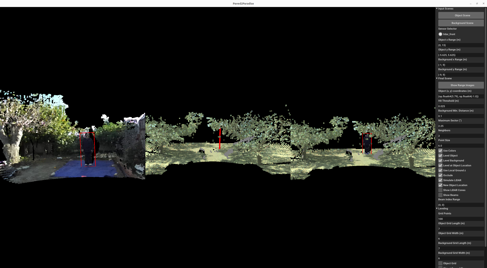

# Paved2Paradise 2.0 🎨

https://github.com/airalcorn2/paved2paradise/assets/1927770/75e6e064-0f9d-4fd5-8fb3-8542720ce4da

A PointPillars model trained _exclusively_ on synthetic data generated by Paved2Paradise can reliably detect humans in orchards—including individuals who are heavily occluded by tree branches.
The vertical red bars indicate the model's estimates of the bounding box centers for the humans.

## Overview

This is the repository for the paper:

> [Michael A. Alcorn](https://sites.google.com/view/michaelaalcorn) and Noah Schwartz. [Paved2Paradise: Cost-Effective and Scalable LiDAR Simulation by Factoring the Real World](https://arxiv.org/abs/2312.01117). CVPR Workshop on Synthetic Data for Computer Vision. 2024.

The code used to produce the results in the paper can be found in [this branch](https://github.com/airalcorn2/paved2paradise/tree/SynData4CV-2024).


An overview of the Paved2Paradise pipeline for generating synthetic scenes (left) and an example synthetic scene (right).
**Left**: The pipeline begins by randomly sampling an object scene (top left) and a background scene (bottom right) and "leveling" both scenes.
The leveling step ensures the object point cloud extracted from the object scene will be placed on the ground in the background scene.
Next, the object point cloud is extracted from the object scene and placed at a randomly sampled location in the detection region.
During the placement step, the object point cloud is rotated to ensure perspective consistency relative to the sensor's location.
The repositioned object point cloud is then combined with the background point cloud, and a final occluding procedure removes points from the scene based on their visibility from the sensor's perspective.
**Right**: The resulting synthetic scene is both realistic and automatically annotated.

## Citation

If you use this code for your own research, please cite:

```
@article{alcorn2023paved2paradise,
   title={Paved2Paradise: Cost-Effective and Scalable LiDAR Simulation by Factoring the Real World},
   author={Alcorn, Michael A. and Schwartz, Noah},
   journal={CVPR Workshop on Synthetic Data for Computer Vision},
   year={2024}
}
```

## Application

### Installing the necessary Python packages

```bash
pip3 install -r requirements.txt
```

### Running the demo application



[`paved2paradise.py`](paved2paradise_demo.py) is a stand-alone GUI application that allows users to explore the Paved2Paradise pipeline with their own point clouds.
To run:

```bash
python3 paved2paradise.py
```

When loading a new object scene PCD, the application expects there to be a JSON file located in the same directory with the same filename prefix that defines the object's bounding box (see [`human_colored.json`](human_colored.json) for an example).
